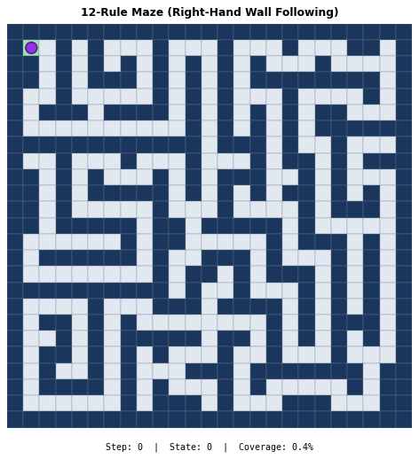
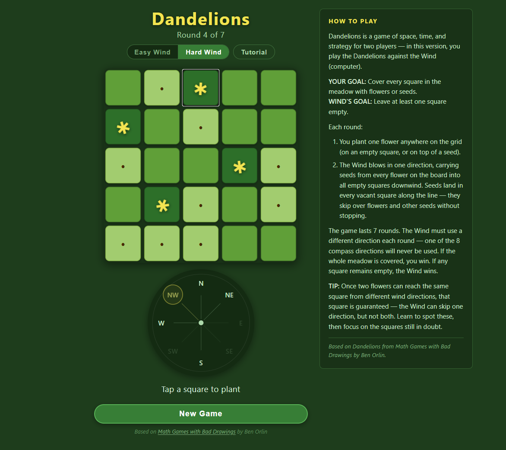

# Ciao! I'm Matteo Niccoli (he/him)

### Geophysicist | Data Scientist | Building Tools for Rigorous Thinking

I'm a geoscientist who solves problems with Python — from subsurface characterization to statistical detection of flawed research. My work sits at the intersection of domain expertise, data science, and AI-assisted reasoning. I build tools that make quantitative skepticism systematic: checking assumptions, questioning numbers, and catching the patterns that don't survive scrutiny.

Currently developing agentic AI applications for document extraction in geotechnical engineering.

Board member at [Software Underground](https://softwareunderground.org/) — open-source geoscience community.

Contact: matteo@mycarta.ca | Blog: [mycarta](https://mycartablog.com) | Twitter: [@my_carta](https://twitter.com/My_Carta)

---

## Featured Work

### Bullshit Detector — Statistical Screening for Research Papers *(open source)*

A Python package for systematically screening published research for statistical red flags and methodological issues. Four-tier detection system, from quick API lookups to deep data analysis.

**What it catches:** p-value inconsistencies, impossible descriptive statistics (GRIMMER), spurious correlations in high-dimensional data, underpowered studies masquerading as significant findings, causal claims without evidence, and language escalation from "association" to "effect."

**What makes it different:** The package includes 12 structured skill files (~2,500 lines) that teach an LLM *when* to reach for which tool and *how* to interpret what it finds. The reasoning frameworks — Mill's Methods inverted as audit checks, Fermi sanity estimation, logical fallacy detection — are as important as the code.

```python
>>> from bullshit_detector.spurious import P_spurious, r_crit
>>> P_spurious(r=0.50, n=21, k=100)
0.884   # 88.4% chance this correlation is spurious
>>> r_crit(n=21)
0.433   # minimum r to even consider at n=21
```

```python
>>> from bullshit_detector.power import achieved_power
>>> achieved_power(effect_size=0.5, n_per_group=16)
{'power': 0.293, 'adequate': False}
# 29% power — less than a coin flip. If significant, probably a false positive.
```

**9 modules, 104 tests, 7 example scripts, 12 skill files.** Published on PyPI.

`pip install bullshit-detector`

Links: [PyPI](https://pypi.org/project/bullshit-detector/) | [GitHub](https://github.com/mycarta/bullshit-detector) | [LinkedIn launch post](https://www.linkedin.com/posts/matteo-niccoli-data-geo_i-built-a-bullshit-detector-then-i-pointed-activity-7434634740688760833-pb9G?utm_source=share&utm_medium=member_desktop&rcm=ACoAAAWAHSUB3NwMfQrHONX5D6DJSGjkS6gMTaA)

---

### Perceptual Colormaps: A Decade of Knowledge Sharing *(open source, professionally motivated)*
*~10 years of research, community contribution, and accessible visualization*

Poor colormap choices create false patterns in scientific data. I've spent a decade developing methods to evaluate colormaps perceptually, sharing the results through papers, blog posts, and interactive tools.


**[Try the interactive app](https://mybinder.org/v2/gh/mycarta/Colormap-distorsions-Panel-app/master?urlpath=lab/tree/Demonstrate_colormap_distortions_interactive_Panel.ipynb)** — see how bad colormaps distort geophysical data.

**Impact:**
- [Evaluation paper](https://library.seg.org/doi/10.1190/tle34080948.1) — **Top 30 most-downloaded SEG papers (2010-2020)**
- **Cited in official [Matplotlib documentation](https://matplotlib.org/stable/users/explain/colors/colormaps.html#references)**
- Blog posts rank **#1 on Google** for "perceptual rainbow" and "perceptual palette images"
- Knowledge exchanges with Peter Kovesi, Kristen Thyng, Bernice Rogowitz, Fabio Crameri
- January 2026: [modernized to Panel 1.8.5 + Python 3.12](https://mycartablog.com/2026/01/24/modernizing-python-code-in-the-ai-era-a-different-kind-of-learning/), added cmcrameri and cmocean collections

Links: [Live app](https://mybinder.org/v2/gh/mycarta/Colormap-distorsions-Panel-app/master?urlpath=lab/tree/Demonstrate_colormap_distortions_interactive_Panel.ipynb) | [Source](https://github.com/mycarta/Colormap-distorsions-Panel-app) | [Paper](https://library.seg.org/doi/10.1190/tle34080948.1) | [SEG Wiki](https://wiki.seg.org/wiki/How_to_evaluate_and_compare_color_maps)

---

## Significant Projects

### Fermi Estimation Framework *(personal project)*
*Teaching LLMs quantitative reasoning through structured laws and worked examples*

A framework of 17 Laws (mechanical + estimation) that teaches AI models to decompose problems, bound unknowns, proceed with imperfect information, and know when to ask for help. Developed over three years, tested on 11 problems with a 6-criteria scoring rubric. Codifies methodology from Weinstein's *Guesstimation* books into explicit rules for human-AI collaboration.

Connected to bullshit-detector as the "Fermi sanity" tier — order-of-magnitude plausibility checks on reported claims.

**Blog series:** [Part 1: The Problem That Wouldn't Compute](https://mycartablog.com/2026/02/07/teaching-an-ai-to-think-like-fermi-part-1-the-problem-that-wouldnt-compute/) | [Part 2: Permission to Guess](https://mycartablog.com/2026/02/25/teaching-an-ai-to-reason-like-fermi-part-2-permission-to-guess/)

**Framework:** [The Laws of Fermi Problem-Solving v4](https://gist.github.com/mycarta#the-laws-of-fermi-problem-solving-v4)

---

### LLM Discipline *(personal project)*
*Anti-sycophancy guardrails and structured prompting for rigorous AI work*

Working practices for getting honest, useful behaviour from language models — learned the hard way, across real projects where sycophancy, silent data corruption, and fabrication under questioning cost real time. Two blog posts document the failure modes and the systems I built around them.

The core principle: AI tools that agree with everything you say are worse than useless for analytical work. Configure them to challenge assumptions, not confirm them.

Blog: [Operational Discipline for LLM Projects](https://mycartablog.com/2026/02/14/operational-discipline-for-llm-projects-what-it-actually-takes/) | [Standing in the Middle of Intelligence](https://mycartablog.com/2026/02/27/standing-in-the-middle-of-intelligence/) | [GitHub](https://github.com/mycarta/llm-discipline)

---

### Be a Geoscience and Data Science Detective *(open source, professionally motivated)*
*The intellectual ancestor of bullshit-detector*

A methodology for combining domain expertise with statistical rigour when evaluating published results. Don't just accept visual/qualitative claims — back them up with custom error flags, bootstrap confidence intervals, influence plots, and distance correlation. This detective approach evolved directly into the bullshit-detector package.

Links: [Blog post](https://mycartablog.com/2020/09/16/be-a-geoscience-and-data-science-detective/) | [Notebook 1](https://github.com/mycarta/Be-a-geoscience-detective/blob/master/Be-a-geoscience-detective.ipynb) | [Notebook 2](https://github.com/mycarta/Be-a-geoscience-detective/blob/master/Be-a-geoscience-detective_example_2.ipynb)

---

### Mill's Methods, Machine Learning, and Drilling Risk *(personal project, professionally motivated)*
*When 19th-century philosophy and neural networks agree*

A drilling problem from a CSEG talk: seven wells, five seismic attributes, four with mud loss problems. Three approaches converged — Mill's Methods of Induction (1843), a simple neural network, and domain expert Lee Hunt — all pointing to the same attributes. The pragmatic insight: the goal isn't finding "the cause," it's building a defensible decision rule under uncertainty.

Links: [Blog post](https://mycartablog.com/2026/01/20/the-value-of-intellectual-play-mill-machine-learning-and-a-drilling-problem-i-couldnt-stop-thinking-about/) | [Notebook](https://github.com/mycarta/predict/blob/master/Geoscience_ML_notebook_4.ipynb)

---

## Fun Projects

### Picobot Optimizer *(personal project)*

How does a nearly blind robot cover every cell in a room? Picobot can only sense its four immediate neighbours — no map, no memory. In 2015, working through Harvey Mudd's CS materials on my own, I optimized the empty room solution from 7 to 6 rules and the maze from 16 to 12. The key insight: the X move (stay put) enables state transitions that let you reuse rules instead of duplicating logic.

Revisited in 2025 with a Python simulator, exhaustive verification, and proper documentation.



Links: [Blog post](https://mycartablog.com/2026/01/31/picobot-revisited-optimizing-a-tiny-robots-rules-ten-years-later/) | [GitHub](https://github.com/mycarta/picobot-optimizer)

---

### Dandelions *(personal project)*

A free, offline, no-ads mobile game based on *Math Games with Bad Drawings* by Ben Orlin. Plant flowers, spread seeds, try to cover every square before the Wind leaves you with gaps. Built with the author's knowledge and encouragement.

Single player vs computer Wind (Easy/Hard) • Interactive tutorial • Installable as offline PWA • No accounts, no tracking

Includes a [JavaScript tutorial for Python developers](https://github.com/mycarta/Dandelions) walking through the game engine.

**[Play it](https://mycarta.github.io/Dandelions)** — works on phone, tablet, or desktop.



Links: [Play](https://mycarta.github.io/Dandelions) | [GitHub](https://github.com/mycarta/Dandelions)

---

## Published Work

**[How to evaluate and compare color maps](https://library.seg.org/doi/10.1190/tle34080948.1)** — *The Leading Edge* 34(8), 2015. Top 30 most-downloaded SEG papers (2010-2020).

**[Mapping and validating lineaments](https://pubs.geoscienceworld.org/seg/tle/article/34/8/948/136625/Mapping-and-validating-lineaments)** — *The Leading Edge* 34(8), 2015. Top 5 most-downloaded TLE papers in 2015-2016

**[Introduction to Classification with SVMs](https://csegrecorder.com/articles/view/machine-learning-in-geoscience-v-introduction-to-classification-with-svms)** — *The Recorder* (CSEG), expert-reviewed.

**[Keep on improving your geocomputing projects](https://curvenote.github.io/testing-jupyter-export-52things/niccoli-keep-on-improving-geocomputing-projects.html)** — Chapter in *52 Things You Should Know About Geocomputing*, 2019.

---

## Community

**Software Underground** — Board Member (2024-present)

**[mycarta blog](https://mycartablog.com)** — 65+ technical posts on geoscience, visualization, data science, and AI.

**Conference talks:** [Transform 2020](https://www.youtube.com/watch?v=rUbvueIF5f8&t=510s) (colormap tool), [TRANSFORM 2021](https://github.com/mycarta/t21-hack-footprint) (FRIDA hackathon)

**Stack Exchange:** [Land percentage in Northern Hemisphere](https://earthscience.stackexchange.com/a/15139/144) — combining map projections with Python to answer a deceptively simple question.

---

<details>
<summary><b>Previous Work & Additional Projects</b></summary>

### Integrated Geophysical Workflows *(professional work)*

Multi-scale characterization for unconventional resources: regional lineament analysis, seismic attribute extraction, 3D morphological segmentation, multivariate analysis. Workflows refined to inform drilling prioritization. Methods transfer to geothermal, groundwater, CO₂ sequestration, and infrastructure stability.

Links: [Lineament mapping](https://pubs.geoscienceworld.org/seg/tle/article/34/8/948/136625/Mapping-and-validating-lineaments) | [Fault proximity](https://github.com/mycarta/faults/blob/master/fun_with_faults.ipynb) | [Seismic tutorial](https://github.com/equinor/segyio-notebooks/blob/master/notebooks/basic/01_basic_tutorial.ipynb)

### FRIDA — Acquisition Footprint Removal *(personal project, professionally applied)*

10+ year project: interactive removal of acquisition footprint noise from 3D seismic data using FFT-based methods. Evolved from MATLAB (2010) through Python port (2014-2018) to Transform 2021 hackathon prototype.

Links: [Transform 2021 demo](https://github.com/mycarta/t21-hack-footprint) | [Tutorial notebooks](https://github.com/mycarta/Footprint-removal-using-multiple-windows) | [52 Things chapter](https://curvenote.github.io/testing-jupyter-export-52things/niccoli-keep-on-improving-geocomputing-projects.html)

### Hackathon Projects

**[Sketch2model](http://sketch2model.ca/)** — 2015 Calgary Geoconvention, Honorary Mention. Hand-drawn sketches → geological models → synthetic seismic.

**[SEG 2016 ML Contest](https://github.com/seg/2016-ml-contest/blob/master/MandMs/02_Facies_classification-MandMs_plurality_voting_classifier.ipynb)** — Top-performing facies classification using shallow ML.

**[FORCE 2020](https://github.com/mycarta/Force-2020-Machine-Learning-competition_predict-lithology-EDA)** — GMM clustering for lithology prediction.

### Wind Calculator *(professional work)*

Swept area method calculator adapted for East Coast North Atlantic offshore conditions. [Repository](https://github.com/mycarta/wind-calculator)

### Additional Repositories

- [Useful-color-related-tools-and-info](https://github.com/mycarta/Useful-color-related-tools-and-info) — Curated colormap resources (66 stars)
- [Computer-vision-in-geoscience](https://github.com/mycarta/Computer-vision-in-geoscience) — Recovering data from published images
- [Enhanced Seaborn pairgrid](https://mycarta.wordpress.com/2019/04/10/data-exploration-in-python-distance-correlation-and-variable-clustering/) — Distance correlation matrix with clustering

### Earth Observation & Remote Sensing Training

InSAR SAR Applications Professional Certificate (edX) • Radar Backscattering (EO College) • NASA ARSET: Fundamentals of Remote Sensing • NASA ARSET: SAR for Disaster & Humanitarian Applications • Climate Geospatial Analysis with Xarray (Coursera) • AI For Good Specialization (Coursera/DeepLearning.AI)

### About Me

**Hobbies:** Drawing and art projects, juggling, longboarding
**Current fixation:** Card tricks and Rubik's cube

</details>

---

*Last updated: March 2026*
